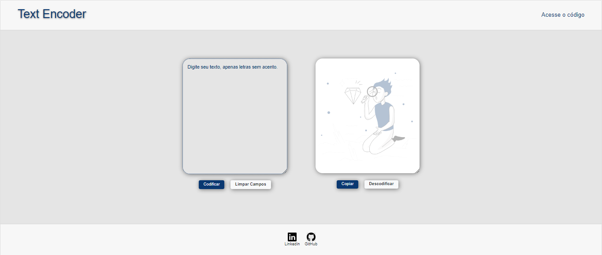

# Text Encoder

## Descrição
O "Text Encoder" é um projeto que permite aos usuários codificar e descodificar mensagens de texto. Os usuários digitam um texto, pressionam o botão "Codificar" e o texto codificado é exibido. Se desejarem, os usuários podem pressionar o botão "Descodificar" para ver a mensagem original.

## Demonstração
Veja o projeto em ação: https://guibarross.github.io/text-encoder/.

## Requisitos
- Navegadores com suporte a JavaScript.

## Instalação
Para clonar o repositório, execute o seguinte comando:
git clone https://github.com/guibarross/text-encoder.git

## Uso
1. Abra o arquivo `index.html` no seu navegador.
2. Digite o texto que deseja codificar.
3. Clique no botão "Codificar" para ver o texto codificado.
4. Se desejar descodificar, clique no botão "Descodificar."

## Tecnologias Utilizadas
- JavaScript para a lógica de codificação/descodificação.
- CSS para estilização.
- Bootstrap para tornar o projeto responsivo.

